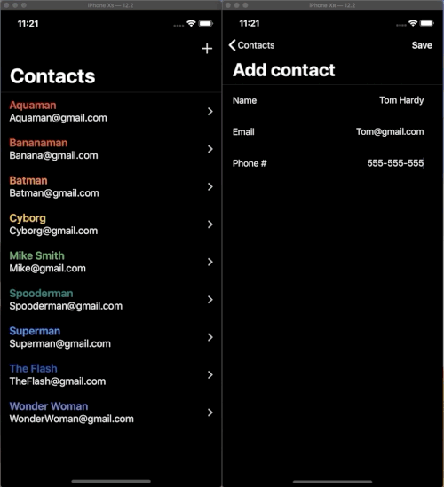

**Realtime Functional Table Data** is a realtime contacts app built with Shopify's [Functional Table Data](https://github.com/Shopify/FunctionalTableData) and [Firebase](https://firebase.google.com/). The idea is simple; each screen subscribes to a model in Firebase and is notified with realtime snapshots everytime its updated. Each snapshot is decoded client-side and passed to Functional Table Data which compares it to the previous state to insert, update, and remove sections and cells that have changed.

| ✨| Features |
| -- | -- |
| ⚡️ | Realtime sync and rendering - no pull-to-refresh |
| 💯| Functional approach to maintaining view state |
| 🙅‍♀️| Programmatic view layout - no storyboards or XIBs |
| 🚀| Agnostic networking layer - swap in any service |

## ⚡️  Realtime updates

Any number of client apps can subscribe to a `User` entity. Whenever a `User` is mutated (one of it's associated contacts is added or removed) the UI of each subscriber is automatically updated in realtime.

| Adding a contact | Removing a contact |
| ---- | ---- | 
|  |  |

## 🏗 Installation

1. Download or clone the `RealtimeFunctionalTableData` repo.
2. Open `RealtimeFunctionalTableData.xcworkspace` in xcode 10.2 or later.
3. From the project directory, open a terminal and run `$ pod install`.
4. Run the `RealtimeFunctionalTableData` target on a device or simulator.

## License
Functional Table Data Playground is under the [MIT License](https://github.com/Shopify/RealtimeFunctionalTableData/blob/master/LICENSE.txt)

## Contributors
Pull requests and bug reports are welcome 🚀

#### Built with ❤️ by:
👨‍💻 Mat Schmid [@schmiddyy](https://github.com/schmidyy)     
👨‍💻 Scott Campbell [@Campbell-Scott](https://github.com/Campbell-Scott)     
🖍 Adam Whitcroft [@AdamWhitcroft](https://github.com/AdamWhitcroft)
